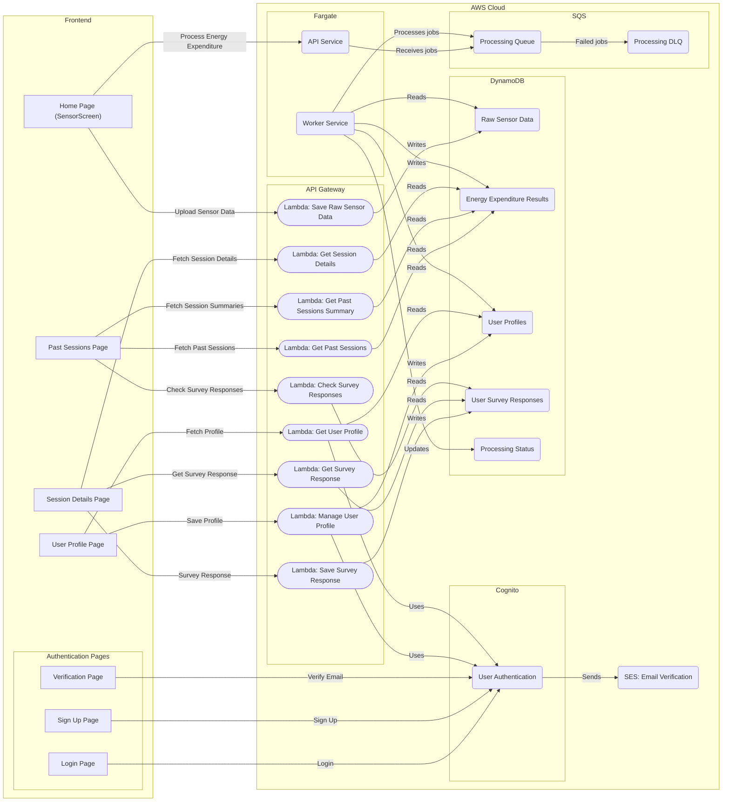

# OpenMetabolics System Architecture

This diagram shows the current architecture of the OpenMetabolics backend and frontend, including all major AWS resources, Lambda functions, SQS queues, and Fargate services.

- The frontend (Flutter app) communicates with AWS Lambda functions via API Gateway.
- User authentication is handled by Cognito.
- Sensor data, user profiles, session results, and survey responses are stored in DynamoDB tables.
- Energy expenditure processing is handled by a Fargate API service and a Fargate worker, with jobs queued in SQS.
- Survey and session management is handled by dedicated Lambda functions.
- SES is used for email verification.

